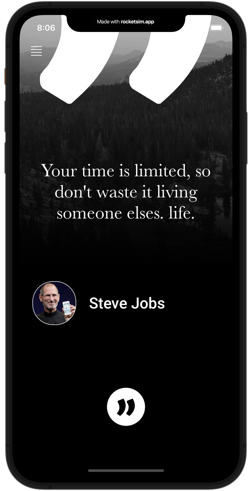
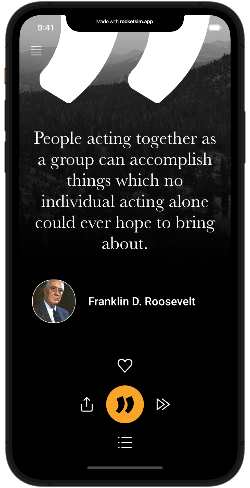
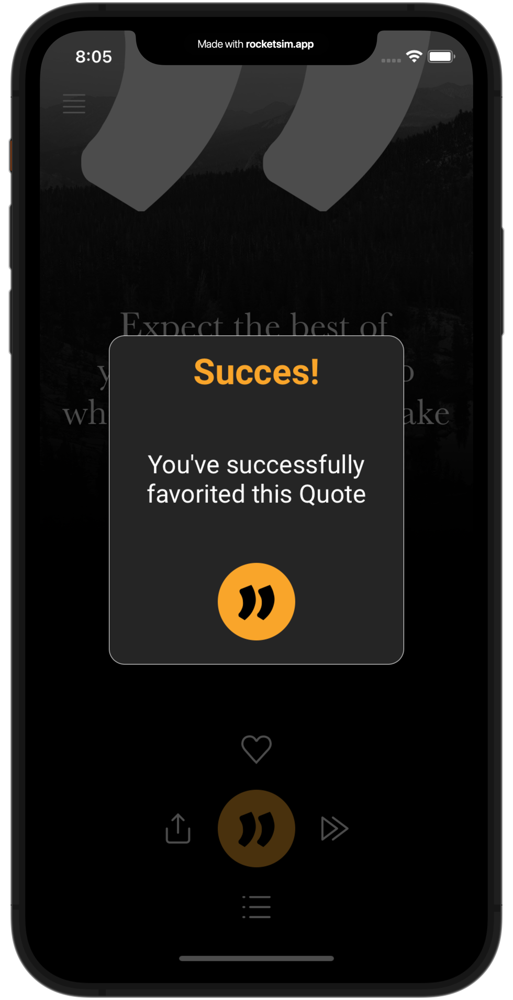

<!DOCTYPE html>
<html>
<head>
	<title>iQuote - Twoja ulubiona aplikacja do zarządzania cytatem</title>
	<meta charset="utf-8">
	<meta name="viewport" content="width=device-width, initial-scale=1">
	<link rel="stylesheet" href="https://maxcdn.bootstrapcdn.com/bootstrap/4.5.2/css/bootstrap.min.css">
	<script src="https://ajax.googleapis.com/ajax/libs/jquery/3.5.1/jquery.min.js"></script>
	<script src="https://cdnjs.cloudflare.com/ajax/libs/popper.js/1.16.0/umd/popper.min.js"></script>
	<script src="https://maxcdn.bootstrapcdn.com/bootstrap/4.5.2/js/bootstrap.min.js"></script>
	<style>
		body {
			background-color: #F9F9F9;
			font-family: Arial, sans-serif;
		}

		h1, h2, h3, h4, h5, h6 {
			font-weight: bold;
		}

		.container {
			padding: 50px;
			margin: 0 auto;
		}

		.main-img {
			width: 100%;
			max-width: 500px;
			margin: 0 auto;
			display: block;
		}

		.gallery-img {
			width: 100%;
			max-width: 200px;
			display: block;
			margin: 0 auto;
			margin-top: 20px;
			margin-bottom: 20px;
		}

		.btn {
			background-color: #007BFF;
			border: none;
			color: white;
			padding: 12px 24px;
			cursor: pointer;
			border-radius: 25px;
			font-size: 16px;
			font-weight: bold;
			transition: background-color 0.3s;
		}

		.btn:hover {
			background-color: #0069D9;
		}

		.menu-link {
			color: #007BFF;
			font-size: 20px;
			font-weight: bold;
			text-decoration: none;
			transition: color 0.3s;
		}

		.menu-link:hover {
			color: #0069D9;
		}

		.section {
			margin-top: 50px;
		}

		.section-header {
			margin-bottom: 20px;
		}

		.section-header h2 {
			font-size: 36px;
			color: #007BFF;
			margin-bottom: 10px;
		}

		.section-header p {
			font-size: 20px;
			color: #4F4F4F;
			margin-bottom: 0;
		}

		.section-img {
			width: 100%;
			max-width: 400px;
			display: block;
			margin: 0 auto;
			margin-top: 20px;
			margin-bottom: 20px;
		}

		.section-text {
			font-size: 20px;
			color: #4F4F4F;
			margin-top: 20px;
			margin-bottom: 20px;
		}

		.section-buttons {
			display: flex;
			justify-content: center;
			align-items: center;
			margin-top: 20px;
			margin-bottom: 20px;
		}

		.section-buttons .btn {
			margin-left: 10px;
			margin-right: 10px;
		}

		.footer {
			background-color: #	padding: 20px;
		color: white;
		text-align: center;
		margin-top: 50px;
	}

	.footer p {
		margin-bottom: 0;
	}

	.footer a {
		color: white;
		font-weight: bold;
		text-decoration: none;
		transition: color 0.3s;
	}

	.footer a:hover {
		color: #DC3545;
	}
</style>
</head>
<body>
<!-- Nagłówek i menu nawigacyjne -->
<nav class="navbar navbar-expand-md bg-light navbar-light">
	<div class="container">
		<a class="navbar-brand" href="#">iQuote</a>
		<button class="navbar-toggler" type="button" data-toggle="collapse" data-target="#collapsibleNavbar">
			<span class="navbar-toggler-icon"></span>
		</button>
		<div class="collapse navbar-collapse" id="collapsibleNavbar">
			<ul class="navbar-nav ml-auto">
				<li class="nav-item">
					<a class="nav-link menu-link" href="#features">Funkcje</a>
				</li>
				<li class="nav-item">
					<a class="nav-link menu-link" href="#pricing">Cennik</a>
				</li>
				<li class="nav-item">
					<a class="nav-link menu-link" href="#about">O nas</a>
				</li>
				<li class="nav-item">
					<a class="nav-link menu-link" href="#contact">Kontakt</a>
				</li>
			</ul>
		</div>
	</div>
</nav>

<!-- Nagłówek i opis aplikacji -->
<div class="container section">
	<div class="row">
		<div class="col-md-6">
			<h1 class="section-header">iQuote</h1>
			<p class="section-text">Twoja ulubiona aplikacja do zarządzania cytatem</p>
			<div class="section-buttons">
				<a href="#" class="btn">Pobierz teraz</a>
			</div>
		</div>
		<div class="col-md-6">
			
		</div>
	</div>
</div>

<!-- Funkcje -->
<div class="container section" id="features">
	<div class="row">
		<div class="col-md-12">
			<h2 class="section-header">Funkcje</h2>
		</div>
		<div class="col-md-6">
			
			
		</div>
		<div class="col-md-6">
			
			
</div>
</div>
<div class="row section">
<div class="col-md-12">
<h3 class="section-header">Funkcjonalności</h3>
</div>
<div class="col-md-6">
<p class="section-text">- Wybieranie i edycja ulubionych cytatów</p>
<p class="section-text">- Przeglądanie cytatu następnego autora</p>
<p class="section-text">- Przeglądanie szczegółów autora na Wikipedii</p>
</div>
<div class="col-md-6">
<p class="section-text">- Edycja tła i czcionki</p>
<p class="section-text">- Dodanie gradientowego tła</p>
<p class="section-text">- Dodanie i usunięcie loga</p>
<p class="section-text">- Udostępnianie cytatu w różnych formatach</p>
</div>
</div>
</div>
<!-- Cennik -->
<div class="container section" id="pricing">
	<div class="row">
		<div class="col-md-12">
			<h2 class="section-header">Cennik</h2>
		</div>
		<div class="col-md-4">
			<div class="card">
				<div class="card-header">
					<h4 class="card-title">Podstawowy</h4>
				</div>
				<div class="card-body">
					<h5 class="card-text">Darmowa</h5>
					<p class="card-text">- Dostęp do podstawowych funkcji</p>
					<p class="card-text">- Reklamy w aplikacji</p>
					<a href="#" class="btn btn-block">Pobierz teraz</a>
				</div>
			</div>
		</div>
		<div class="col-md-4">
			<div class="card">
				<div class="card-header">
					<h4 class="card-title">Premium</h4>
				</div>
				<div class="card-body">
					<h5 class="card-text">$4.99 / miesiąc</h5>
					<p class="card-text">- Dostęp do wszystkich funkcji</p>
					<p class="card-text">- Bez reklam w aplikacji</p>
					<a href="#" class="btn btn-block">Kup teraz</a>
				</div>
			</div>
		</div>
		<div class="col-md-4">
			<div class="card">
				<div class="card-header">
					<h4 class="card-title">Enterprise</h4>
				</div>
				<div class="card-body">
					<h5 class="card-text">Kontakt</h5>
					<p class="card-text">- Dostęp do wszystkich funkcji</p>
					<p class="card-text">- Wsparcie techniczne</p>
					<a href="#" class="btn btn-block">Skontaktuj się z nami</a>
				</div>
			</div>
</div>
		</div>
	</div>
<!-- O nas -->
<div class="container section" id="about">
	<div class="row">
		<div class="col-md-12">
			<h2 class="section-header">O nas</h2>
		</div>
		<div class="col-md-6">
			<p class="section-text">Jesteśmy zespołem pasjonatów, którzy uwielbiają motywować innych do osiągania swoich celów. Nasza aplikacja iQuote została stworzona, aby pomóc Ci znaleźć inspirację i motywację w ulubionych cytatach.</p>
			<p class="section-text">Pobierz iQuote już teraz i dołącz do milionów ludzi, którzy korzystają z niej na całym świecie.</p>
		</div>
		<div class="col-md-6">
			
		</div>
	</div>
</div>

<!-- Kontakt -->
<div class="container section" id="contact">
	<div class="row">
		<div class="col-md-12">
			<h2 class="section-header">Kontakt</h2>
		</div>
		<div class="col-md-6">
			<p class="section-text">Jeśli masz jakieś pytania lub sugestie, skontaktuj się z nami za pomocą poniższego formularza.</p>
			<form>
				<div class="form-group">
					<label for="name">Imię i nazwisko:</label>
					<input type="text" class="form-control" id="name">
				</div>
				<div class="form-group">
					<label for="email">Adres e-mail:</label>
					<input type="email" class="form-control" id="email">
				</div>
				<div class="form-group">
					<label for="message">Wiadomość:</label>
					<textarea class="form-control" rows="5" id="message"></textarea>
				</div>
				<button type="submit" class="btn">Wyślij</button>
			</form>
		</div>
		<div class="col-md-6">
			<p class="section-text">Możesz również skontaktować się z nami bezpośrednio za pomocą poniższych informacji kontaktowych:</p>
			<p class="section-text">Telefon: +48 123 456 789</p>
			<p class="section-text">E-mail: kontakt@iquote.pl</p>
			<p class="section-text">Adres: ul. Piękna 12/4, 00-000 Warszawa</p>
		</div>
	</div>
</div>

<!-- Stopka -->
<div class="footer bg-dark">
	<p>&copy; 2023 iQuote. Wszelkie prawa zastrzeżone. <a href="#">Polityka prywatności</a></p>
</div>
</body>
</html>
```


